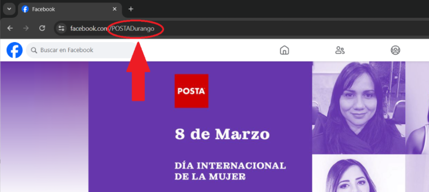

# SOCIAL MEDIA SCRAPING MODULE
Machine learning project that identifies tendencies for a Durango (Mexico) local news company

# Read first before anything else
######In order to get the whole code to work, you need to install 'requirements.txt' file, these are the dependencies needed for your python environment.

`python3 -m venv env` ---> Creates a new python virtual environment
`source env/scripts/activate` ---> Activates the recently created virtual environment (command may vary from windows, mac and linux or your specific file system)
`pip install -r requirements.txt` ---> Gets all the dependencies needed for this project

###Chrome driver installation:
This project uses selenium to work, which is a automated testing tool for chrome, chromedriver updates relatively often, you need to update it and add it to your path environment variable:

Download chromedriver at: https://googlechromelabs.github.io/chrome-for-testing/#stable

(latest stable version you can find)

save it whereever you want:

after that, make sure to add the path to chromedriver to your environment variables:

if you're currently having troubles with chromedrive related issues, please refer to chromedriver page troubleshooting section at: https://chromedriver.chromium.org/home#h.p_ID_60

###Data collecting module:

This module consists of 3 specific files: facebook_scraper.py, instagram_scraper.py and tiktok_scraper.py

To get each to work, simply run via command line:

##Facebook:
(WARNING) this scraper is the most problematic one since facebook suffered from data privacy lawsuits and is often updating their platform to make facebook a scraping-hostile platform, with this in mind, the .csv scraper might be wack specially with small facebook pages with few interactions

`py facebook_scraper.py`

You'll be asked to prompt the facebook page subdomain:
`$Introduce the website to be scraped: `
Enter the facebook subdomain (facebook page) you want to scrape:

then you'll be asked for the name of your document (csv) where your scraped data will be stored:

`$Name your csv file: `

Make sure to just write the name, the file type is .csv by default

## Instagram:
This is simpler than the facebook scraper, when executed, it types credentials into corresponding fields and goes over all posts individually to collect data and stores it into a csv file.

You'll be asked to prompt the Instagram account subdomain:
`$Introduce the website to be scraped:`

Enter the instagram account subdomain you want to scrape:

(Instagram account subdomain image)

then you’ll be asked for the name of your document (csv) where your scraped data will be stored:

`$Name your csv file:`

Make sure to just write the name, the file type is .csv by default

## Tiktok:
This scraper is a little tricky, you execute the tiktok_scraper.py file and then selenium opens the chrome browser and immediately you will be promted with a CAPTCHA alike popup, you'll need to pass through manually:

(Image of the tiktok CAPTCHA)

as the instagram scraper this one works alike, it goes over each post and collects titles, likes, comments and number of saves

You'll be asked to prompt the tiktok account subdomain:
`$Introduce the website to be scraped:`

Enter the tiktok account subdomain you want to scrape:

(tiktok account subdomain image)

then you’ll be asked for the name of your document (csv) where your scraped data will be stored:

`$Name your csv file:`

Make sure to just write the name, the file type is .csv by default

